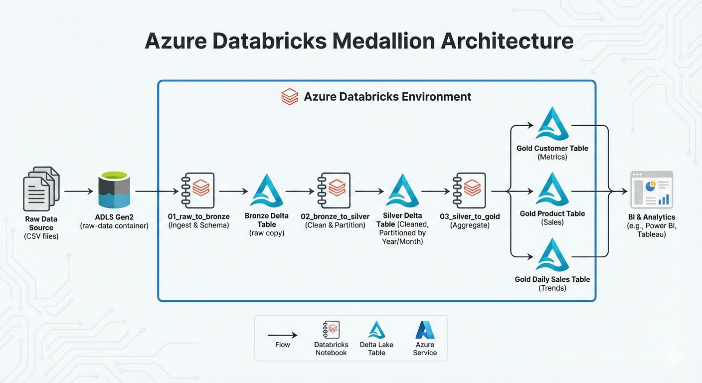

# E-commerce Customer Behavior: Medallion Architecture
This project demonstrates an End-to-End Data Engineering pipeline using **Azure Databricks** and **Delta Lake**. It processes raw e-commerce data through Bronze, Silver, and Gold layers to provide actionable business insights.

## 🏗️ Architecture

The pipeline follows the **Medallion Architecture**:
* **Bronze:** Raw CSV ingestion with schema enforcement.
* **Silver:** Data cleaning, type casting, and feature engineering (Date/Time extraction).
* **Gold:** Business-level aggregations (Customer metrics, Product performance, Daily Sales).

## 📊 Pipeline Details
### 1. Ingestion & Setup
* Mounted ADLS Gen2 containers using Service Principal credentials.
* Defined a strict schema to prevent data corruption during the CSV read process.

### 2. Transformation (Silver)
* Handled missing values in `CustomerID` and `InvoiceNo`.
* Filtered out negative quantities (returns) to focus on successful sales.
* Calculated `TotalPrice` and extracted granular time features like `Hour_of_day` and `Day_of_week`.

### 3. Aggregation (Gold)
* **Customer Insights:** Total spend and purchase frequency per user.
* **Product Analytics:** High-performing products by revenue and volume.
* **Global Sales:** Daily revenue trends partitioned by country.

## 🛠️ Tech Stack:

To build this pipeline, the following professional data engineering tools were utilized:

| Category | Tools |
| :--- | :--- |
| **Cloud Platform** |  |
| **Data Processing** |   |
| **Language** |   |
| **Storage & Format** |  |